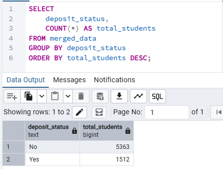
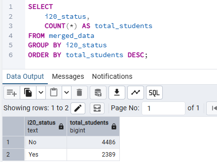
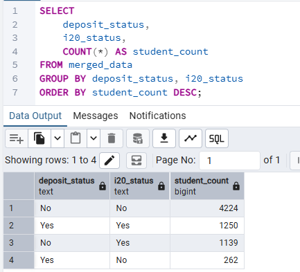
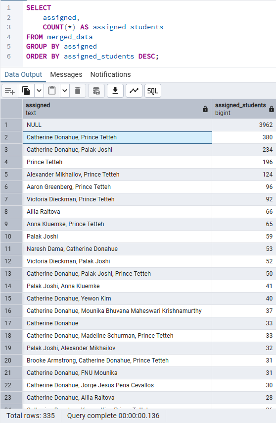
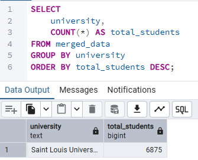
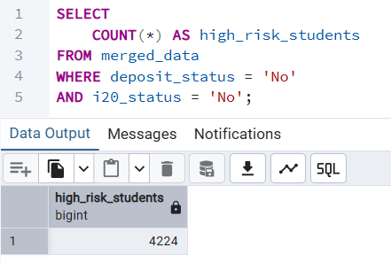

# Exploratory Data Analysis & Compliance Insight Report

## International Student Compliance Analytics — Week 2 Deliverable

Prepared by: Ronachel Marie Digma  
Program: Excelerate Internship Program  
Date Submitted: May 2026

---

# 1. Introduction

This report presents a structured exploratory data analysis (EDA) of institutional student compliance datasets using PostgreSQL.

The analysis focused on identifying patterns related to:

- student eligibility
- enrollment compliance
- I-20 processing
- payment completion
- assignment workload distribution
- operational compliance risk indicators

SQL aggregation and segmentation techniques were used to evaluate compliance trends and identify workflow bottlenecks across institutional processes.

---

# 2. Data Preparation

The datasets were imported into PostgreSQL and analyzed using SQL-based exploratory analysis methods.

During the import process, several data preparation challenges were encountered, including:

- inconsistent CSV formatting
- delimiter conflicts
- malformed rows
- column mismatch errors
- unstructured raw text formatting

The datasets were cleaned, validated, and successfully imported into PostgreSQL before conducting compliance-focused analysis queries.

---

# 3. Eligibility Analysis

## Deposit Status Distribution

The following query was used to analyze deposit completion status across students.

| Deposit Status | Total Students |
|---|---|
| Yes | 1512 |
| No | 5363 |

### Key Observation

The majority of students have not completed deposit requirements. This may indicate enrollment-processing bottlenecks or pending financial compliance requirements.

---

## I-20 Status Distribution

The following query was used to analyze I-20 processing completion.

| I20 Status | Total Students |
|---|---|
| Yes | 2389 |
| No | 4486 |

### Key Observation

A significant proportion of students remain without completed I-20 processing, suggesting delays in documentation or compliance workflows.

---

# 4. Enrollment Document and Eligibility Analysis

A combined analysis was conducted to identify compliance risk clusters based on deposit completion and I-20 processing status.

| Deposit Status | I20 Status | Student Count |
|---|---|---|
| No | No | 4224 |
| Yes | Yes | 1250 |
| No | Yes | 1139 |
| Yes | No | 262 |

### Key Observation

The largest compliance segment consists of students with incomplete deposit requirements and missing I-20 processing.

This cluster represents the highest operational and compliance risk group requiring further monitoring and institutional intervention.

---

# 5. Government Fee Payment Analysis

An assignment workload analysis was conducted to evaluate staff distribution and operational allocation patterns.

### Key Observation

Student assignments appear unevenly distributed across staff members.

Several records remain unassigned, while some staff combinations manage disproportionately large student caseloads.

This may indicate workload imbalance and operational dependency risks within the compliance management workflow.

---

# 6. Institutional Distribution Analysis

The dataset was analyzed based on institutional representation.

### Key Observation

All analyzed records were associated with Saint Louis University, indicating that the current dataset represents a single institutional population.

---

# 7. High Risk Student Identification

The following query isolated students lacking both deposit completion and I-20 processing.

| High Risk Students |
|---|
| 4224 |

### Key Observation

A large number of students fall within the highest-risk compliance category, requiring immediate monitoring and operational prioritization.

---

# 8. Summary of Key Findings

## Major Insights Discovered

- Most students have incomplete deposit requirements.
- I-20 processing completion remains relatively low.
- The largest compliance risk cluster consists of students lacking both deposit completion and I-20 processing.
- Student assignment workloads are unevenly distributed.

## Notable Disparities

- Significant differences exist between completed and incomplete compliance groups.
- Large concentrations of students remain within high-risk operational categories.

## Early Indicators of Compliance Risk

- High volume of unprocessed records
- Large number of incomplete compliance cases
- Uneven assignment distributions
- Operational dependency on limited staff combinations

## Areas Requiring Further Monitoring

- Deposit completion progression
- I-20 processing timelines
- Staff workload balancing
- Compliance backlog reduction

---

# 9. Conclusion

The exploratory analysis successfully identified several operational and compliance-related patterns within the institutional datasets.

PostgreSQL-based analysis enabled structured segmentation of compliance status, assignment distributions, and workflow risk indicators.

The findings from this report will support the development of dashboard metrics and validation logic in subsequent project phases.