# Week 3 Dashboard Development, Metric Validation & Compliance Monitoring

## International Student Compliance Monitoring Dashboard
Prepared by: Ronachel Marie Digma  
Program: Data Visualization Associate Internship  
Week: Week 3

---

# Dashboard Overview

This project focused on building an institutional compliance monitoring dashboard using PostgreSQL datasets and Google Looker Studio.

The dashboard was designed to monitor:
- Student deposit compliance
- I20 approval compliance
- Advisor assignment monitoring
- Advisor workload distribution
- Institutional compliance performance

The dashboard was validated using SQL queries executed directly in PostgreSQL to ensure metric accuracy and reconciliation.

---

## Dashboard Preview

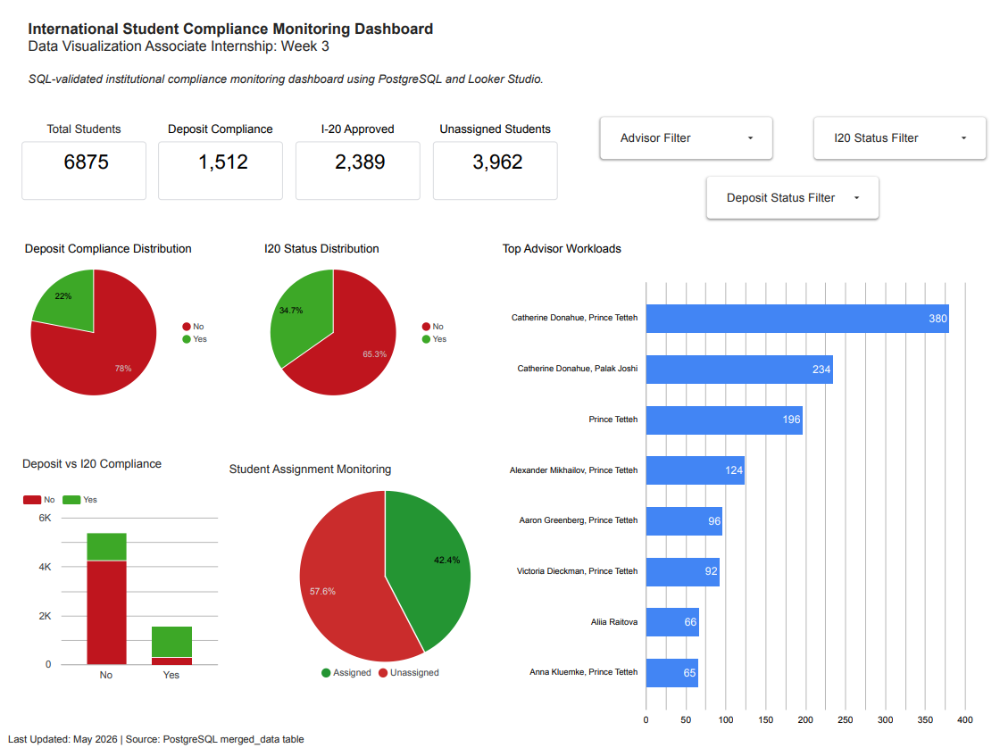

---

# Looker Studio Dashboard Link

Dashboard Link:  
[Dashboard](https://datastudio.google.com/reporting/1ad71f21-3117-47ae-9dfa-1542265cfdfa)

---

# Dashboard Design Documentation

## Dashboard Structure

The dashboard was divided into the following sections:

1. KPI Scorecards
2. Deposit Compliance Monitoring
3. I20 Status Monitoring
4. Advisor Workload Analysis
5. Student Assignment Monitoring
6. Interactive Dashboard Filters

---

# Dashboard Filters

The dashboard contains the following filters:

- Advisor Filter
- I20 Status Filter
- Deposit Status Filter

These filters allow dynamic compliance monitoring across institutional categories.

## Filter Controls Screenshot

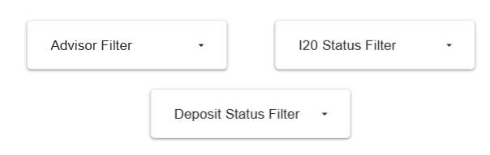

---

# Dashboard Metrics

| Metric | Definition | Source Table |
|---|---|---|
| Total Students | Total student records in merged dataset | merged_data |
| Deposit Completed | Students with completed deposit status | merged_data |
| I20 Approved | Students with approved I20 status | merged_data |
| Unassigned Students | Students without assigned advisors | merged_data |
| Advisor Workloads | Student distribution across advisors | merged_data |

---

## KPI Scorecards

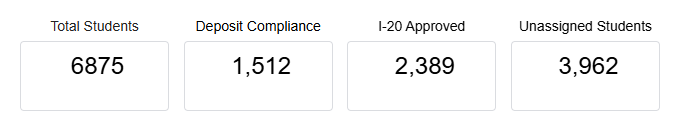

---

# Visualization Rationale

## Scorecards
Used to provide high-level institutional KPIs for quick monitoring.

## Pie Charts
Used to visualize proportional compliance distributions.

### Deposit Compliance Distribution

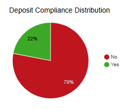

### I20 Status Distribution

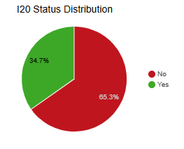

---

## Stacked Column Chart
Used to compare deposit compliance against I20 approval status.

### Deposit vs I20 Compliance

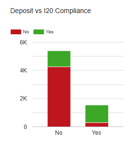

---

## Assignment Monitoring
Used to monitor assigned versus unassigned student distribution.

### Student Assignment Monitoring

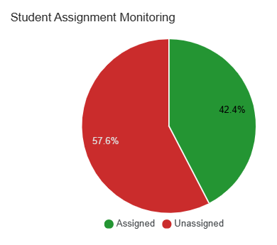

---

## Advisor Workload Analysis
Used to identify workload imbalance across institutional advisors.

### Advisor Workload Distribution

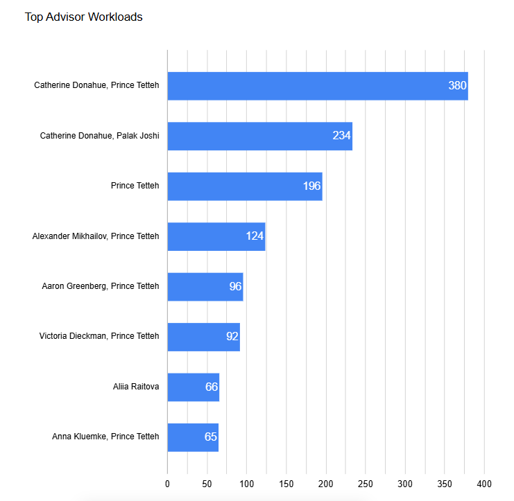

---

# SQL Validation Scripts

## Total Students Validation

```sql
SELECT COUNT(reference_id) AS total_students
FROM merged_data;
```

Expected Output:
6875

### SQL Validation Output

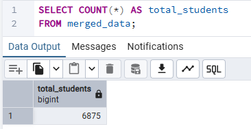

---

## Deposit Completed Validation

```sql
SELECT deposit_status,
       COUNT(*) AS total_students
FROM merged_data
GROUP BY deposit_status;
```

Expected Output:
- Yes = 1512
- No = 5363

### SQL Validation Output

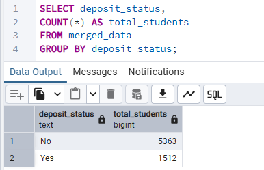

---

## I20 Approved Validation

```sql
SELECT i20_status,
       COUNT(*) AS total_students
FROM merged_data
GROUP BY i20_status;
```

Expected Output:
- Yes = 2389
- No = 4486

### SQL Validation Output

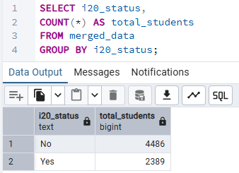

---

## Assignment Status Validation

```sql
SELECT
CASE
    WHEN assigned IS NULL THEN 'Unassigned'
    ELSE 'Assigned'
END AS assignment_status,
COUNT(*) AS total_students
FROM merged_data
GROUP BY assignment_status;
```

### SQL Validation Output

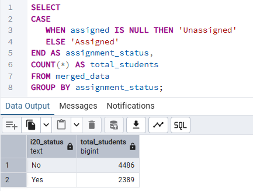

---

## Advisor Workload Validation

```sql
SELECT assigned,
       COUNT(*) AS assigned_students
FROM merged_data
WHERE assigned IS NOT NULL
GROUP BY assigned
ORDER BY assigned_students DESC;
```

### SQL Validation Output

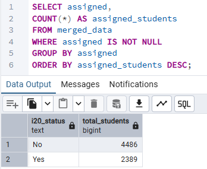

---

# Looker Studio Calculated Field Logic

A calculated field was created inside Looker Studio to classify students into Assigned and Unassigned categories dynamically.

## Assignment Status Logic

```sql
CASE
    WHEN assigned = "NULL" THEN "Unassigned"
    WHEN assigned IS NULL THEN "Unassigned"
    WHEN assigned = "" THEN "Unassigned"
    ELSE "Assigned"
END
```

## Calculated Field Screenshot

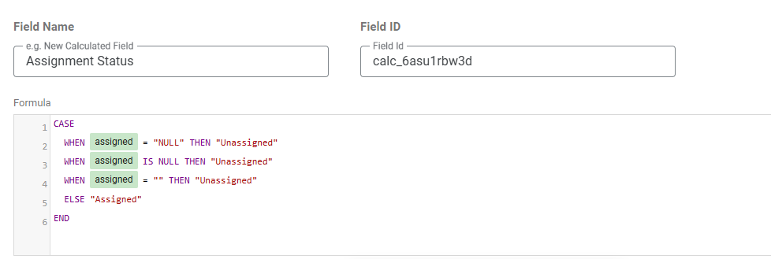

---

# Metric Reconciliation Summary

All dashboard metrics were validated using PostgreSQL SQL queries before reconciliation with Looker Studio visualizations.

Validation steps included:
- Row count verification
- Compliance percentage verification
- Cross-category aggregation validation
- Advisor workload verification

No major discrepancies were identified between PostgreSQL outputs and dashboard metrics after validation.

---

# Compliance Insight Summary

## Key Findings

- A significant portion of students remain unassigned to advisors.
- Deposit compliance remains relatively low compared to the total student population.
- I20 approval rates indicate incomplete compliance progression for many students.
- Advisor workload distribution is uneven across institutional staff.

## Identified Risk Areas

- High number of unassigned students
- Incomplete deposit compliance
- Delayed I20 approval progression

## Operational Inefficiencies

- Advisor assignment imbalance
- Compliance bottlenecks in document and payment processing

## Areas Requiring Monitoring

- Advisor assignment completion
- Deposit compliance improvement
- I20 processing completion rates

---

# Tools Used

- PostgreSQL
- SQL
- Google Looker Studio
- GitHub